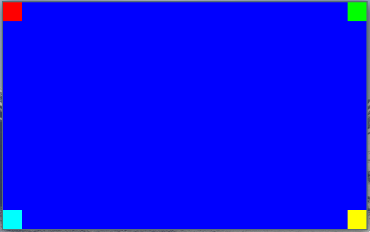

# Manipulating Pixels
In the previous chapter we created a window and filled it with blue color. This works but it's cumbersome to index the correct location in the buffer as well as defining the color as a 32-bit integer. In this chapter we will look at creating another source file which will make all of that a lot easier. Paving the way to finally make some triangles appear.

## Creating the Renderer
To keep the `src/main.c` file clean all the code related to rendering pixels will be inside `src/renderer.c` file. Let's create that file and associated header file.

```sh
touch src/renderer.h
touch src/renderer.c
```

Initially the renderer will contain some macros to help define colors more easily, as well as indexing and writing pixels to the pixels byte array. To demonstrate this functionality we'll also add a function for filling the window with a color and filling a rectangle (subset of the window) with a color.

### renderer.h
Start by filling in the header guard defines this is common practice for all header files to prevent them from being included every time:

```c
// renderer.h

#ifndef RENDERER_INCLUDED
#define RENDERER_INCLUDED

// TODO: Declarations goes here

#endif // RENDERER_INCLUDED
```

Now replace the `TODO: Declarations goes here` comment with the following struct declaration. This struct will be used to pass information about the pixel buffer we're rendering into to the rendering. This helps keep the number of arguments we need to pass into macros and functions to a minimum. We'll also add a helper function for creating instances of this struct:

```c
typedef struct RendererTargetBuffer {
    int32_t width;
    int32_t height;
    int32_t bytes_per_pixel;
    uint8_t* pixels;
} RendererTargetBuffer;

RendererTargetBuffer 
renderer_create_target_buffer(int32_t width, int32_t height, int32_t bytes_per_pixel, uint8_t* pixels);
```

Declare the `RendererRect` struct below the `RendererTargetBuffer` struct declaration:

```c
typedef struct RendererRect {
    int32_t x;
    int32_t y;
    int32_t w;
    int32_t h;
} RendererRect;
```

Add the following macros below the `RendererRect` struct. These macros help pack 3 or four channel color values into a single 32 bit integer, as well as indexing the pixel buffer by offset or x,y coordinates:

```c
// Pack 3 color bytes into one uint32
#define PackColorRGB(r, g, b) (r & 0xff) << 16 | (g & 0xff) << 8 | (b & 0xff)

// Pack 4 color bytes into one uint32
#define PackColorRGBA(r, g, b, a) (a & 0xff) << 24 | PackColorRGB(r, g, b)

// Index pixel at x, y coordinates within RendererTargetBuffer target
#define IndexPixel(x, y, target) (x + y * target.width) * target.bytes_per_pixel

// Put pixel at offset into target
#define PutPixelByteOffset(target, offset, color) *(uint32_t *)(target.pixels + offset) = color

// Put pixel at x,y into target
#define PutPixelXY(target, x, y, color) PutPixelByteOffset(target, IndexPixel(x, y, target), color)
```

Below the macro definitions we can add the function declarations. We'll add three functions for now; one to help create the `RendererTargetBuffer` structure and the two others to fill entire window or a part of the window with desired color:

```c
RendererTargetBuffer 
renderer_create_target_buffer(int32_t width, int32_t height, int32_t bytes_per_pixel, uint8_t* pixels);

void
renderer_fill(RendererTargetBuffer buffer, uint32_t color);

void 
renderer_fill_rect(RendererTargetBuffer buffer, RendererRect rect, uint32_t color);
```

### renderer.c

The implementation of `src/renderer.c` will be fairily straight forward because of the macros and structure we've defined in the header. Put the following content inside the `src/renderer.c` file:

```c
// renderer.c

#include <stdint.h>
#include "renderer.h"

RendererTargetBuffer
renderer_create_target_buffer(int32_t width, int32_t height, int32_t bytes_per_pixel, uint8_t *pixels)
{
    RendererTargetBuffer target = {
        width, height, bytes_per_pixel, pixels
    };

    return target;
}

void 
renderer_fill(RendererTargetBuffer buffer, uint32_t color)
{
    uint32_t fill_until = buffer.width * buffer.height * buffer.bytes_per_pixel;
    uint32_t per_pixel_add = buffer.bytes_per_pixel;
    for (int offset = 0; offset < fill_until; offset += per_pixel_add)
    {
        PutPixelByteOffset(buffer, offset, color);
    }
}

void 
renderer_fill_rect(RendererTargetBuffer buffer, RendererRect rect, uint32_t color)
{
    for (int y = rect.y; y < rect.y + rect.h; y++)
    {
        for(int x = rect.x; x < rect.x + rect.w; x++)
        {
            PutPixelXY(buffer, x, y, color);
        }
    }
}
```

>Beware, there's no clipping implemented yet so passing in rectangles which goes outside the available pixel buffer space will cause segmentation faults or other memory related errors.

## Testing
We'll make some changes to `src/main.c` to test the new `src/renderer.c` implementation. Filling the window with a color like before as well as putting some colored squares in each corner of the window.

Update `src/main.c` with the following, put this code between the `game_window_surface_lock_pixels(game_window);` and `game_window_surface_unlock_and_update_pixels(game_window);` lines:
```c
int32_t bytes_per_pixel = 4;
RendererTargetBuffer pixel_buffer = 
    renderer_create_target_buffer(game_window->pixel_buffer_width, game_window->pixel_buffer_height, bytes_per_pixel, game_window->pixels);

renderer_fill(pixel_buffer, PackColorRGB(0, 0, 255));

if (game_window->pixel_buffer_width != 0)
{
    RendererRect top_left = {
        0, 0, 32, 32
    };

    RendererRect top_right = {
        pixel_buffer.width - 32,
        0, 32, 32
    };

    RendererRect bottom_left = {
        0, 
        pixel_buffer.height - 32,
        32, 32
    };

    RendererRect bottom_right = {
        pixel_buffer.width - 32,
        pixel_buffer.height - 32,
        32, 32
    };

    renderer_fill_rect(pixel_buffer, top_left, PackColorRGB(255, 0, 0));
    renderer_fill_rect(pixel_buffer, top_right, PackColorRGB(0, 255, 0));
    renderer_fill_rect(pixel_buffer, bottom_left, PackColorRGB(0, 255, 255));
    renderer_fill_rect(pixel_buffer, bottom_right, PackColorRGB(255, 255, 0));
}
```

Don't forget to include the `src/renderer.h` file at the top of `src/main.c` as well:

```c
#include "renderer.h"
```

Now all that's left to do is updating the `CMakeLists.txt` to include `src/renderer.c` when building the application. 

```cmake
add_executable(back_to_basics src/main.c src/game_window.c src/renderer.c)
```

Now try to build the application and if everything was alright observe the results, it should look like this:


## Full diff for this chapter

```diff
modified   CMakeLists.txt
@@ -7,5 +7,5 @@ set(CMAKE_C_STANDARD 11)
 find_package(SDL2 REQUIRED)
 include_directories(back_to_basics ${SDL2_INCLUDE_DIRS})
 
-add_executable(back_to_basics src/main.c src/game_window.c)
+add_executable(back_to_basics src/main.c src/game_window.c src/renderer.c)
 target_link_libraries(back_to_basics ${SDL2_LIBRARIES})
modified   src/main.c
@@ -3,6 +3,7 @@
 #include <SDL2/SDL.h>
 
 #include "game_window.h"
+#include "renderer.h"
 
 int main(int argc, char* argv[])
 {
@@ -21,14 +22,39 @@ int main(int argc, char* argv[])
 
         game_window_surface_lock_pixels(game_window);
 
-        uint32_t *pixels_32bpp = (uint32_t *)game_window->pixels;
-        for (int y = 0; y < game_window->pixel_buffer_height; y++)
+        int32_t bytes_per_pixel = 4;
+        RendererTargetBuffer pixel_buffer = 
+            renderer_create_target_buffer(game_window->pixel_buffer_width, game_window->pixel_buffer_height, bytes_per_pixel, game_window->pixels);
+
+        renderer_fill(pixel_buffer, PackColorRGB(0, 0, 255));
+
+        if (game_window->pixel_buffer_width != 0)
         {
-            uint32_t row = y * game_window->pixel_buffer_width;
-            for (int x = 0; x < game_window->pixel_buffer_width; x++)
-            {
-                pixels_32bpp[x + row] = 0xff0000ff;
-            }
+            RendererRect top_left = {
+                0, 0, 32, 32
+            };
+
+            RendererRect top_right = {
+                pixel_buffer.width - 32,
+                0, 32, 32
+            };
+
+            RendererRect bottom_left = {
+                0, 
+                pixel_buffer.height - 32,
+                32, 32
+            };
+
+            RendererRect bottom_right = {
+                pixel_buffer.width - 32,
+                pixel_buffer.height - 32,
+                32, 32
+            };
+
+            renderer_fill_rect(pixel_buffer, top_left, PackColorRGB(255, 0, 0));
+            renderer_fill_rect(pixel_buffer, top_right, PackColorRGB(0, 255, 0));
+            renderer_fill_rect(pixel_buffer, bottom_left, PackColorRGB(0, 255, 255));
+            renderer_fill_rect(pixel_buffer, bottom_right, PackColorRGB(255, 255, 0));
         }
 
         game_window_surface_unlock_and_update_pixels(game_window);
new file   src/renderer.c
@@ -0,0 +1,37 @@
+// renderer.c
+
+#include <stdint.h>
+#include "renderer.h"
+
+RendererTargetBuffer
+renderer_create_target_buffer(int32_t width, int32_t height, int32_t bytes_per_pixel, uint8_t *pixels)
+{
+    RendererTargetBuffer target = {
+        width, height, bytes_per_pixel, pixels
+    };
+
+    return target;
+}
+
+void 
+renderer_fill(RendererTargetBuffer buffer, uint32_t color)
+{
+    uint32_t fill_until = buffer.width * buffer.height * buffer.bytes_per_pixel;
+    uint32_t per_pixel_add = buffer.bytes_per_pixel;
+    for (int offset = 0; offset < fill_until; offset += per_pixel_add)
+    {
+        PutPixelByteOffset(buffer, offset, color);
+    }
+}
+
+void 
+renderer_fill_rect(RendererTargetBuffer buffer, RendererRect rect, uint32_t color)
+{
+    for (int y = rect.y; y < rect.y + rect.h; y++)
+    {
+        for(int x = rect.x; x < rect.x + rect.w; x++)
+        {
+            PutPixelXY(buffer, x, y, color);
+        }
+    }
+}
\ No newline at end of file
new file   src/renderer.h
@@ -0,0 +1,44 @@
+// renderer.h
+
+#ifndef RENDERER_INCLUDED
+#define RENDERER_INCLUDED
+
+typedef struct RendererTargetBuffer {
+    int32_t width;
+    int32_t height;
+    int32_t bytes_per_pixel;
+    uint8_t* pixels;
+} RendererTargetBuffer;
+
+typedef struct RendererRect {
+    int32_t x;
+    int32_t y;
+    int32_t w;
+    int32_t h;
+} RendererRect;
+
+// Pack 3 color bytes into one uint32
+#define PackColorRGB(r, g, b) (r & 0xff) << 16 | (g & 0xff) << 8 | (b & 0xff)
+
+// Pack 4 color bytes into one uint32
+#define PackColorRGBA(r, g, b, a) (a & 0xff) << 24 | PackColorRGB(r, g, b)
+
+// Index pixel at x, y coordinates within RendererTargetBuffer target
+#define IndexPixel(x, y, target) (x + y * target.width) * target.bytes_per_pixel
+
+// Put pixel at offset into target
+#define PutPixelByteOffset(target, offset, color) *(uint32_t *)(target.pixels + offset) = color
+
+// Put pixel at x,y into target
+#define PutPixelXY(target, x, y, color) PutPixelByteOffset(target, IndexPixel(x, y, target), color)
+
+RendererTargetBuffer 
+renderer_create_target_buffer(int32_t width, int32_t height, int32_t bytes_per_pixel, uint8_t* pixels);
+
+void
+renderer_fill(RendererTargetBuffer buffer, uint32_t color);
+
+void 
+renderer_fill_rect(RendererTargetBuffer buffer, RendererRect rect, uint32_t color);
+
+#endif // RENDERER_INCLUDED
\ No newline at end of file
```