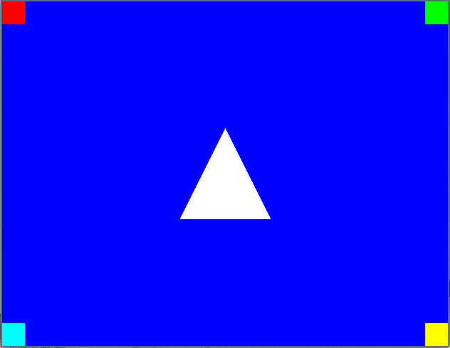
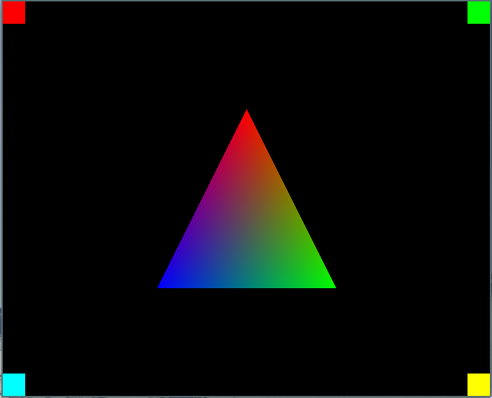

# Hello Triangle

The basic building block of any 3d rendering is the triangle. Even the most complex 3d scenes in AAA games is composed of thousands or millions of tiny triangles. This chapter will be like a "Hello, World" graphics programming edition. All our rendering will still be done in screen space, but this is still a huge milestone.

We'll introduce more struct declarations in the renderer and also add a few math utility macros. Finally we'll add code to `src/main.c` to display a single triangle.

## Rendering a Triangle
To start off we'll add the necessary structures and functions to the renderer. One function in particular I will try to explain extra clearly, because the way it works almost feels magical. 

### renderer.h

Add the following to `src/renderer.h`:

```c
typedef struct RendererPoint {
    int32_t x;
    int32_t y;
} RendererPoint;

typedef struct RendererTriangle {
    RendererPoint p0;
    RendererPoint p1;
    RendererPoint p2;
} RendererTriangle;

void 
renderer_fill_triangle(RendererTargetBuffer buffer, RendererTriangle triangle, uint32_t color);
```

These should all be fairly self explanatory, the `RendererPoint` allowing us to hold a single (x, y) coordinate pair as well as the `RendererTriangle` with one point for each corner. Last but not least the function we'll use to render a single triangle.

### renderer.c

Add this function below the `#include` statements in `src/renderer.c`:

```c
static inline int32_t 
signed_area2(RendererPoint p0, RendererPoint p1, RendererPoint p2)
{
    return (p1.x - p0.x) * (p2.y - p0.y) -
        (p1.y - p0.y) * (p2.x - p0.x);
}
```

This function will give us the squared signed area based on the three `RendererPoints` passed to it. This will alow us to determine if a point is inside or outside the three edges of a triangle, as well as how far inside the point is.

Mathematically we're calculating the determinant of a 2x2 matrix which gives us the signed area squared of the parallelogram spanned by the A, B, C points or put in different terms, the distance of C from the line A<->B:

```
| Ax , Bx , Cx |
| Ay , By , Cy | = signed_area2(A, B, C)
| 1  , 1  , 1  |

| Bx-Ax , Cx-Ax | = (Bx-Ax) * (Cy-Ay) -
| By-Ay , Cy-Ay |   (By-Ay) * (Cx-Ax)
```

Now let's add the `renderer_fill_triangle` function. This function will determine the rectangle encapsulating the triangle and iterate through all pixels within. Before entering the loop we're using the `signed_area_2` to determine the barycentric coordinates for each triangle edge. This allows us to instead of doing the expensive calculation inside the inner loop we can just add the calculated increment each iteration. For now this is only used for the position of the pixels but the same concept can be applied to any value we want to interpolate (for example colors or texture coordinates). We know that as long as all three barycentric coordinates is positive the pixel is within the triangle.

```c
void
renderer_fill_triangle(RendererTargetBuffer buffer, RendererTriangle triangle, uint32_t color)
{
    RendererPoint p0 = triangle.p0;
    RendererPoint p1 = triangle.p1;
    RendererPoint p2 = triangle.p2;

    int32_t min_x = Min3(p0.x, p1.x, p2.x);
    int32_t max_x = Max3(p0.x, p1.x, p2.x);
    int32_t min_y = Min3(p0.y, p1.y, p2.y);
    int32_t max_y = Max3(p0.y, p1.y, p2.y);

    int32_t a12 = p1.y - p2.y; int32_t b12 = p2.x - p1.x;
    int32_t a20 = p2.y - p0.y; int32_t b20 = p0.x - p2.x;
    int32_t a01 = p0.y - p1.y; int32_t b01 = p1.x - p0.x;

    RendererPoint test_p = { min_x, min_y };

    int32_t bcoord_row0 = signed_area2(p1, p2, test_p);
    int32_t bcoord_row1 = signed_area2(p2, p0, test_p);
    int32_t bcoord_row2 = signed_area2(p0, p1, test_p);

    for(test_p.y = min_y; test_p.y < max_y; test_p.y++)
    {
        int32_t bcoord0 = bcoord_row0;
        int32_t bcoord1 = bcoord_row1;
        int32_t bcoord2 = bcoord_row2;

        for(test_p.x = min_x; test_p.x < max_x; test_p.x++)
        {
            if ((bcoord0|bcoord1|bcoord2) >= 0)
            {
                PutPixelXY(buffer, test_p.x, test_p.y, color);
            }

            bcoord0 += a12;
            bcoord1 += a20;
            bcoord2 += a01;
        }

        bcoord_row0 += b12;
        bcoord_row1 += b20;
        bcoord_row2 += b01;
    }
}
```

This code wont compile just yet because we're using some utility macros to get the minimum and maximum values from three distinct values. Let's go ahead and create the `src/math_utils.h` file.

```sh
touch src/math_utils.h
```

### math_utils.h
Add the following to `src/math_utils.h`:

```c
// math_utils.h

#ifndef MATH_UTILS_INCLUDED
#define MATH_UTILS_INCLUDED

#define Min(x, y) (x < y ? x : y)
#define Min3(x, y, z) Min(x, Min(y, z))

#define Max(x, y) (x > y ? x : y)
#define Max3(x, y, z) Max(x, Max(y, z))

#endif // MATH_UTILS_INCLUDED
```

And finally include the file in `src/renderer.c`:

```c
#include "math_utils.h"
```

### main.c

All that's left now is calling the `renderer_fill_triangle` function. Add this code below the `renderer_fill_rect` function calls:

```c
RendererPoint center = { 
    pixel_buffer.width / 2,
    pixel_buffer.height / 2
};
RendererTriangle center_triangle = {
    {center.x, center.y - 64},
    {center.x + 64, center.y + 64}, 
    {center.x - 64, center.y + 64}
};

renderer_fill_triangle(pixel_buffer, center_triangle, PackColorRGB(255, 255, 255));
```

This will render a white triangle in the center of the window.



## Adding Colors
Just rendering single colored triangles is going to get boring, so let's add some per vertex coloring.

Start by modifying the `RendererTriangle` structure inside `src/renderer.h` to include one color for each corner:

```c
typedef struct RendererTriangle {
    RendererPoint p0;
    RendererPoint p1;
    RendererPoint p2;
    uint32_t c0;
    uint32_t c1;
    uint32_t c2;
} RendererTriangle;
```

Also add macro to help unpack the individual color bytes from a 32-bit color integer:

```c
// Unpack 3 color bytes from one uint32
#define UnpackColorRGB(color, r, g, b) r=(color>>16)&0xff;g=(color>>8)&0xff;b=(color>>0)&0xff
```

Now in `src/renderer.c` add the code to set up color interpolation as we render our triangle. Add the following below `int32_t bcoord_row2 = signed_area2(p0, p1, test_p);`:

```c
int32_t total_area2 = bcoord_row0 + bcoord_row1 + bcoord_row2;
float total_area2_inv = 1.0f / total_area2;

uint8_t color_r0; uint8_t color_r1; uint8_t color_r2;
uint8_t color_g0; uint8_t color_g1; uint8_t color_g2;
uint8_t color_b0; uint8_t color_b1; uint8_t color_b2;

UnpackColorRGB(triangle.c0, color_r0, color_g0, color_b0);
UnpackColorRGB(triangle.c1, color_r1, color_g1, color_b1);
UnpackColorRGB(triangle.c2, color_r2, color_g2, color_b2);

int32_t color_base_r0 = (int32_t)(color_r0 << 18);
int32_t color_base_g0 = (int32_t)(color_g0 << 18);
int32_t color_base_b0 = (int32_t)(color_b0 << 18);

int32_t color_r10 = (int32_t)(((color_r1 - color_r0) << 18) * total_area2_inv);
int32_t color_r20 = (int32_t)(((color_r2 - color_r0) << 18) * total_area2_inv);
int32_t color_g10 = (int32_t)(((color_g1 - color_g0) << 18) * total_area2_inv);
int32_t color_g20 = (int32_t)(((color_g2 - color_g0) << 18) * total_area2_inv);
int32_t color_b10 = (int32_t)(((color_b1 - color_b0) << 18) * total_area2_inv);
int32_t color_b20 = (int32_t)(((color_b2 - color_b0) << 18) * total_area2_inv);
```

Knowing each color channel is just 8 bits of data we shift up each channel by 18 bits. This allows more precision as we interpolate the color across the triangle.

Add the pixel color calculation inside the inner loop rendering the triangle, within the `if ((bcoord0|bcoord1|bcoord2) >= 0)` conditional block:

```c
uint8_t color_r = (uint8_t)((color_base_r0 + bcoord1 * color_r10 + bcoord2 * color_r20) >> 18);
uint8_t color_g = (uint8_t)((color_base_g0 + bcoord1 * color_g10 + bcoord2 * color_g20) >> 18);
uint8_t color_b = (uint8_t)((color_base_b0 + bcoord1 * color_b10 + bcoord2 * color_b20) >> 18);
uint32_t pixel_color = PackColorRGB(color_r, color_g, color_b);

PutPixelXY(buffer, test_p.x, test_p.y, pixel_color);
```

Finallly remove the single color parameter from the `renderer_fill_triangle` function remember to modify both the `src/renderer.c` and `src/renderer.h` files:

```c
// renderer.h
void 
renderer_fill_triangle(RendererTargetBuffer buffer, RendererTriangle triangle);

// renderer.c
void
renderer_fill_triangle(RendererTargetBuffer buffer, RendererTriangle triangle) 
{
    // ...
}

```

Now the last piece of this puzzle is to make some changes in `src/main.c` to render the new fancy colored triangle, we'll change the background fill color to black to make the triangle colors stand out more and also make the triangle bigger:

```c
// Replace the old blue color:
renderer_fill(pixel_buffer, PackColorRGB(0, 0, 0));

// Replace the code to render the white triangle:
RendererTriangle center_triangle = {
    {center.x, center.y - 128},
    {center.x + 128, center.y + 128}, 
    {center.x - 128, center.y + 128},
    PackColorRGB(255, 0, 0),
    PackColorRGB(0, 255, 0),
    PackColorRGB(0, 0, 255)
};

renderer_fill_triangle(pixel_buffer, center_triangle);
```

Isn't that pretty!



## Full diff for this chapter

```diff
diff --git a/src/main.c b/src/main.c
index a904a2a..3f124c9 100644
--- a/src/main.c
+++ b/src/main.c
@@ -26,7 +26,7 @@ int main(int argc, char* argv[])
         RendererTargetBuffer pixel_buffer = 
             renderer_create_target_buffer(game_window->pixel_buffer_width, game_window->pixel_buffer_height, bytes_per_pixel, game_window->pixels);
 
-        renderer_fill(pixel_buffer, PackColorRGB(0, 0, 255));
+        renderer_fill(pixel_buffer, PackColorRGB(0, 0, 0));
 
         if (game_window->pixel_buffer_width != 0)
         {
@@ -55,6 +55,21 @@ int main(int argc, char* argv[])
             renderer_fill_rect(pixel_buffer, top_right, PackColorRGB(0, 255, 0));
             renderer_fill_rect(pixel_buffer, bottom_left, PackColorRGB(0, 255, 255));
             renderer_fill_rect(pixel_buffer, bottom_right, PackColorRGB(255, 255, 0));
+
+            RendererPoint center = { 
+                pixel_buffer.width / 2,
+                pixel_buffer.height / 2
+            };
+            RendererTriangle center_triangle = {
+                {center.x, center.y - 128},
+                {center.x + 128, center.y + 128}, 
+                {center.x - 128, center.y + 128},
+                PackColorRGB(255, 0, 0),
+                PackColorRGB(0, 255, 0),
+                PackColorRGB(0, 0, 255)
+            };
+
+            renderer_fill_triangle(pixel_buffer, center_triangle);
         }
 
         game_window_surface_unlock_and_update_pixels(game_window);
diff --git a/src/math_utils.h b/src/math_utils.h
new file mode 100644
index 0000000..7cac0fa
--- /dev/null
+++ b/src/math_utils.h
@@ -0,0 +1,12 @@
+// math_utils.h
+
+#ifndef MATH_UTILS_INCLUDED
+#define MATH_UTILS_INCLUDED
+
+#define Min(x, y) (x < y ? x : y)
+#define Min3(x, y, z) Min(x, Min(y, z))
+
+#define Max(x, y) (x > y ? x : y)
+#define Max3(x, y, z) Max(x, Max(y, z))
+
+#endif // MATH_UTILS_INCLUDED
\ No newline at end of file
diff --git a/src/renderer.c b/src/renderer.c
index 829c826..a5362ae 100644
--- a/src/renderer.c
+++ b/src/renderer.c
@@ -2,6 +2,14 @@
 
 #include <stdint.h>
 #include "renderer.h"
+#include "math_utils.h"
+
+static inline int32_t 
+signed_area2(RendererPoint p0, RendererPoint p1, RendererPoint p2)
+{
+    return (p1.x - p0.x) * (p2.y - p0.y) -
+        (p1.y - p0.y) * (p2.x - p0.x);
+}
 
 RendererTargetBuffer
 renderer_create_target_buffer(int32_t width, int32_t height, int32_t bytes_per_pixel, uint8_t *pixels)
@@ -34,4 +42,77 @@ renderer_fill_rect(RendererTargetBuffer buffer, RendererRect rect, uint32_t colo
             PutPixelXY(buffer, x, y, color);
         }
     }
+}
+
+void
+renderer_fill_triangle(RendererTargetBuffer buffer, RendererTriangle triangle)
+{
+    RendererPoint p0 = triangle.p0;
+    RendererPoint p1 = triangle.p1;
+    RendererPoint p2 = triangle.p2;
+
+    int32_t min_x = Min3(p0.x, p1.x, p2.x);
+    int32_t max_x = Max3(p0.x, p1.x, p2.x);
+    int32_t min_y = Min3(p0.y, p1.y, p2.y);
+    int32_t max_y = Max3(p0.y, p1.y, p2.y);
+
+    int32_t a12 = p1.y - p2.y; int32_t b12 = p2.x - p1.x;
+    int32_t a20 = p2.y - p0.y; int32_t b20 = p0.x - p2.x;
+    int32_t a01 = p0.y - p1.y; int32_t b01 = p1.x - p0.x;
+
+    RendererPoint test_p = { min_x, min_y };
+
+    int32_t bcoord_row0 = signed_area2(p1, p2, test_p);
+    int32_t bcoord_row1 = signed_area2(p2, p0, test_p);
+    int32_t bcoord_row2 = signed_area2(p0, p1, test_p);
+    
+    int32_t total_area2 = bcoord_row0 + bcoord_row1 + bcoord_row2;
+    float total_area2_inv = 1.0f / total_area2;
+
+    uint8_t color_r0; uint8_t color_r1; uint8_t color_r2;
+    uint8_t color_g0; uint8_t color_g1; uint8_t color_g2;
+    uint8_t color_b0; uint8_t color_b1; uint8_t color_b2;
+
+    UnpackColorRGB(triangle.c0, color_r0, color_g0, color_b0);
+    UnpackColorRGB(triangle.c1, color_r1, color_g1, color_b1);
+    UnpackColorRGB(triangle.c2, color_r2, color_g2, color_b2);
+
+    int32_t color_base_r0 = (int32_t)(color_r0 << 18);
+    int32_t color_base_g0 = (int32_t)(color_g0 << 18);
+    int32_t color_base_b0 = (int32_t)(color_b0 << 18);
+
+    int32_t color_r10 = (int32_t)(((color_r1 - color_r0) << 18) * total_area2_inv);
+    int32_t color_r20 = (int32_t)(((color_r2 - color_r0) << 18) * total_area2_inv);
+    int32_t color_g10 = (int32_t)(((color_g1 - color_g0) << 18) * total_area2_inv);
+    int32_t color_g20 = (int32_t)(((color_g2 - color_g0) << 18) * total_area2_inv);
+    int32_t color_b10 = (int32_t)(((color_b1 - color_b0) << 18) * total_area2_inv);
+    int32_t color_b20 = (int32_t)(((color_b2 - color_b0) << 18) * total_area2_inv);
+
+    for(test_p.y = min_y; test_p.y < max_y; test_p.y++)
+    {
+        int32_t bcoord0 = bcoord_row0;
+        int32_t bcoord1 = bcoord_row1;
+        int32_t bcoord2 = bcoord_row2;
+
+        for(test_p.x = min_x; test_p.x < max_x; test_p.x++)
+        {
+            if ((bcoord0|bcoord1|bcoord2) >= 0)
+            {
+                uint8_t color_r = (uint8_t)((color_base_r0 + bcoord1 * color_r10 + bcoord2 * color_r20) >> 18);
+                uint8_t color_g = (uint8_t)((color_base_g0 + bcoord1 * color_g10 + bcoord2 * color_g20) >> 18);
+                uint8_t color_b = (uint8_t)((color_base_b0 + bcoord1 * color_b10 + bcoord2 * color_b20) >> 18);
+                uint32_t pixel_color = PackColorRGB(color_r, color_g, color_b);
+
+                PutPixelXY(buffer, test_p.x, test_p.y, pixel_color);
+            }
+
+            bcoord0 += a12;
+            bcoord1 += a20;
+            bcoord2 += a01;
+        }
+
+        bcoord_row0 += b12;
+        bcoord_row1 += b20;
+        bcoord_row2 += b01;
+    }
 }
\ No newline at end of file
diff --git a/src/renderer.h b/src/renderer.h
index e4d1f19..2c7f3e7 100644
--- a/src/renderer.h
+++ b/src/renderer.h
@@ -17,12 +17,29 @@ typedef struct RendererRect {
     int32_t h;
 } RendererRect;
 
+typedef struct RendererPoint {
+    int32_t x;
+    int32_t y;
+} RendererPoint;
+
+typedef struct RendererTriangle {
+    RendererPoint p0;
+    RendererPoint p1;
+    RendererPoint p2;
+    uint32_t c0;
+    uint32_t c1;
+    uint32_t c2;
+} RendererTriangle;
+
 // Pack 3 color bytes into one uint32
 #define PackColorRGB(r, g, b) (r & 0xff) << 16 | (g & 0xff) << 8 | (b & 0xff)
 
 // Pack 4 color bytes into one uint32
 #define PackColorRGBA(r, g, b, a) (a & 0xff) << 24 | PackColorRGB(r, g, b)
 
+// Unpack 3 color bytes from one uint32
+#define UnpackColorRGB(color, r, g, b) r=(color>>16)&0xff;g=(color>>8)&0xff;b=(color>>0)&0xff
+
 // Index pixel at x, y coordinates within RendererTargetBuffer target
 #define IndexPixel(x, y, target) (x + y * target.width) * target.bytes_per_pixel
 
@@ -41,4 +58,7 @@ renderer_fill(RendererTargetBuffer buffer, uint32_t color);
 void 
 renderer_fill_rect(RendererTargetBuffer buffer, RendererRect rect, uint32_t color);
 
+void 
+renderer_fill_triangle(RendererTargetBuffer buffer, RendererTriangle triangle);
+
 #endif // RENDERER_INCLUDED
\ No newline at end of file

```

