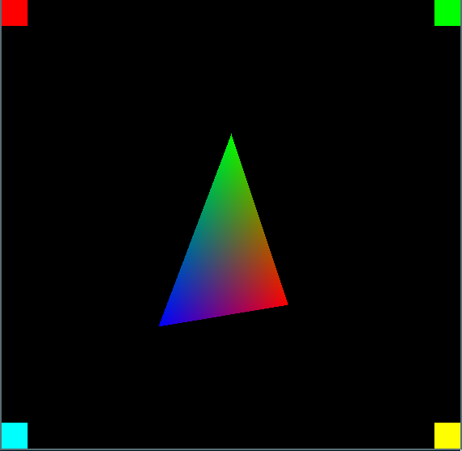
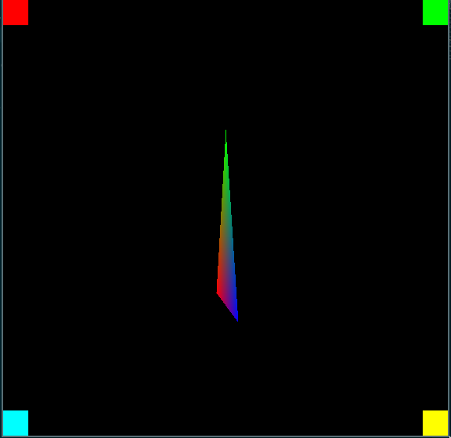

# Three Dimensions

Until now we've defined the triangle in screen space, and there's been no concept of depth or perspective. Now it's time to move to defining our triangle in world space and projecting it to the screen, accounting for perpective and depth.


## Math Functions
To project the triangle coordinates we'll have to add some functions for matrix and vector operations. In a previous chapter we created `math_utils.h` with some macros to help calculate the minimum and maximum values. We'll rename and extend that file to be just `math.h`. 

Start by renaming the `math_utils.h` file to `math.h`, including updating the include paths and header guards for consistency.

```sh
mv src/math_utils.h src/math.h
```

After renaming the file and updating the file to reflect the name change it should look like this:

```c
// math.h

#ifndef MATH_INCLUDED
#define MATH_INCLUDED

#include <math.h>

#define Min(x, y) (x < y ? x : y)
#define Min3(x, y, z) Min(x, Min(y, z))

#define Max(x, y) (x > y ? x : y)
#define Max3(x, y, z) Max(x, Max(y, z))

// NOTE: Add the additional code here.

#endif // MATH_INCLUDED

```

### Vector Operations

Now add the definitions for the `Vector3` and `Vector4` types to `src/math.h`:

```c
typedef struct Vector3
{
    union
    {
        float xyz[3];
        struct {
            float x;
            float y;
            float z;
        };
    };
} Vector3;

typedef struct Vector4
{
    union
    {
        float xyzw[4];
        struct {
            float x;
            float y;
            float z;
            float w;
        };
    };
} Vector4;
```

Now add the functions we'll need to use doing calculations with the vectors to `src/math.h`. These functions will help us multiply, add, subtract, or get the inner and outer products of vectors.

```c
static inline Vector3
vector3_create(float x, float y, float z)
{
    Vector3 result = {
        x, y, z
    };

    return result;
}

static inline Vector3
vector3_subtract(Vector3 a, Vector3 b)
{
    Vector3 result;
    result.x = a.x - b.x;
    result.y = a.y - b.y;
    result.z = a.z - b.z;

    return result;
}

static inline float
vector3_length(Vector3 a)
{
    return sqrt(a.x * a.x + a.y * a.y + a.z * a.z);
}

static inline Vector3
vector3_normalize(Vector3 a)
{
    float length = vector3_length(a);
    if (length <= 0.0f)
    {
        return vector3_create(0.0f, 0.0f, 1.0f);
    }

    Vector3 result = vector3_create(a.x / length, a.y / length, a.z / length);

    return result;
}

static inline Vector3
vector3_cross(Vector3 a, Vector3 b)
{
    float x = a.y * b.z - a.z * b.y;
    float y = a.z * b.x - a.x * b.z;
    float z = a.x * b.y - a.y * b.x;
    return vector3_create(x, y, z);
}

static inline float
vector3_dot(Vector3 a, Vector3 b)
{
    return a.x * b.x + a.y * b.y + a.z * b.z;
}

static inline Vector3
vector4_mul(Vector4 a, Vector3 b)
{
    Vector3 result;
    result.x = a.x * b.x;
    result.y = a.y * b.y;
    result.z = a.z * b.z;
    return result;
}
```

### Matrix Operations

Moving on we'll also have to add the `Matrix4` struct and functions to create matrices. The matrix is very important and will be used to project our triangle vertices to the screen.

Add the struct definition for `Matrix4` to `src/math.h`:

```c
typedef struct Matrix4
{
    union {
        struct {
            float x1; float y1; float z1; float w1;
            float x2; float y2; float z2; float w2;
            float x3; float y3; float z3; float w3;
            float x4; float y4; float z4; float w4;
        };
        float m[16];
    };
} Matrix4;
```

We'll need to create matrices for transforming vertices add these functions which will create matrices allowing us to define the orientation of our triangle in the 'world', Also where our point of view is, and approximating a pinhole camera lens to give some perspective.

Add these functions to `src/math.h`:
```c

// matrix4_lookat_lh will be used to define a "camera" in our scene. The `eye` parameter defines where the camera is. The `at` parameter defines where the camera is facing towards and the `up` parameter defines which direction is up. Up is usually (0.0, 1.0, 0.0).
static inline Matrix4
matrix4_lookat_lh(Vector3 eye, Vector3 at, Vector3 up)
{
    Vector3 z = vector3_normalize(vector3_subtract(at, eye));
    Vector3 x = vector3_normalize(vector3_cross(up, z));
    Vector3 y = vector3_cross(z, x);

    float eye_x = vector3_dot(x, eye);
    float eye_y = vector3_dot(y, eye);
    float eye_z = vector3_dot(z, eye);

    Matrix4 result = {
        x.x, x.y, x.z, 0.0f,
        y.x, y.y, y.z, 0.0f,
        z.x, z.y, z.z, 0.0f,
        -eye_x, -eye_y, -eye_z, 1.0f
    };

    return result;
}

// matrix4_perspective_lh will be used to approximate a pinhole camera perspective. This allow us defining the field-of-view as well as aspect ratio and near/far planes.
static inline Matrix4
matrix4_perspective_lh(float fov, float aspect_ratio, float z_near, float z_far)
{
    float degrees_to_radius = M_PI / 180.0f;
    float height = 1.0f / tanf(degrees_to_radius * fov / 2.0f);
    float width = height / aspect_ratio;

    float far_near = z_far - z_near;

    Matrix4 result = {
        width, 0.0f, 0.0f, 0.0f,
        0.0f, height, 0.0f, 0.0f,
        0.0f, 0.0f, z_far / far_near, 1.0f,
        0.0f, 0.0f, -z_near * z_far / far_near, 0.0f};

    return result;
}

// matrix4_rotate_[x,y,z] functions will create a matrix which rotates around any of the three major axis.
static inline Matrix4
matrix4_rotate_x(float rotation)
{
    float rot_sin = sinf(rotation);
    float rot_cos = cosf(rotation);

    Matrix4 result = {
        1.0f, 0.0f, 0.0f, 0.0f,
        0.0f, rot_cos, -rot_sin, 0.0f,
        0.0f, rot_sin, rot_cos, 0.0f,
        0.0f, 0.0f, 0.0f, 1.0f
    };

    return result;
}

static inline Matrix4
matrix4_rotate_y(float rotation)
{
    float rot_sin = sinf(rotation);
    float rot_cos = cosf(rotation);

    Matrix4 result = {
        rot_cos, 0.0f, rot_sin, 0.0f,
        0.0f, 1.0f, 0.0f, 0.0f,
        -rot_sin, 0.0f, rot_cos, 0.0f,
        0.0f, 0.0f, 0.0f, 1.0f};

    return result;
}

static inline Matrix4
matrix4_rotate_z(float rotation)
{
    float rot_sin = sinf(rotation);
    float rot_cos = cosf(rotation);

    Matrix4 result = {
        rot_cos, -rot_sin, 0.0f, 0.0f,
        rot_sin, rot_cos, 0.0f, 0.0f,
        0.0f, 0.0f, 1.0f, 0.0f,
        0.0f, 0.0f, 0.0f, 1.0f};

    return result;
}
```

Finally we'll also have to add function to multiply matrices with other matrices or vectors. This is essentially the same operation but since we don't have any generic function to multiply NxM vectors they will work with the specific types we already have defined. Add the following to `src/math.h`:

```c
static inline Matrix4 
matrix4_multiply(Matrix4 a, Matrix4 b)
{
    Matrix4 result = {0.0f, 0.0f, 0.0f, 0.0f,
                      0.0f, 0.0f, 0.0f, 0.0f,
                      0.0f, 0.0f, 0.0f, 0.0f,
                      0.0f, 0.0f, 0.0f, 0.0f};

    int i,j,k;
    for (i = 0; i < 4; i++)
    {
        for (j = 0; j < 4; j++)
        {
            for (k = 0; k < 4; k++)
            {
                result.m[j+i*4] += a.m[k+i*4]*b.m[j+k*4];
            }
        }
    }
    return result;
}

static inline Vector4
matrix4_multiply_vector3(Matrix4 m, Vector3 v)
{
    float x = v.x, y = v.y, z = v.z;
    Vector4 result = {(x*m.x1 + y * m.x2 + z * m.x3 + m.x4),
                      (x*m.y1 + y * m.y2 + z * m.y3 + m.y4),
                      (x*m.z1 + y * m.z2 + z * m.z3 + m.z4),
                      (x*m.w1 + y * m.w2 + z * m.w3 + m.w4)};
    return result;
}
```

This concludes all the math functions we'll be requiring for now.


## Transforming Vertices
To transform the vertices we'll another file `src/vertex_transform.c` and the associated `src/vertex_transform.h`. Since the functions will be doing possibly a lot of math operations on very similar data they're written to allow passing in arrays of data instead of transforming data one by one. Doing this will help improve memory and cache performance.

```sh
touch src/vertex_transform.h
touch src/vertex_transform.c
```

Populate the files with their content:

`vertex_transform.h`
```c
// vertex_transform.h

#ifndef VERTEX_TRANSFORM_H
#define VERTEX_TRANSFORM_H

#include "math.h"

void
vertex_transform_positions(Matrix4 transform, Vector3* positions, Vector3* transformed_positions, int count);

void
vertex_transform_map_to_viewport(int width, int height, Vector3 *positions, Vector3 *mapped_positions, int count);

#endif // VERTEX_TRANSFORM_H
```

`vertex_transform.c`
```c
// vertex_transform.c

#include "vertex_transform.h"

void
vertex_transform_positions(Matrix4 transform, Vector3 *positions, Vector3 *transformed_positions, int count)
{
    for (int i = 0; i < count; ++i)
    {
        Vector3 position = *(positions + i);
        Vector4 transformed = matrix4_multiply_vector3(transform, position);

        Vector3 result = {
            transformed.x / transformed.w,
            transformed.y / transformed.w,
            transformed.z / transformed.w,
        };

        *(transformed_positions + i) = result;
    }
}

void
vertex_transform_map_to_viewport(int width, int height, Vector3 *positions, Vector3 *mapped_positions, int count)
{
    for (int i = 0; i < count; ++i)
    {
        Vector3 position = *(positions + i);
        Vector3 result = {
            (0.5f + position.x * 0.5f) * width,
            (1.0f - (0.5f + position.y * 0.5f)) * height,
            (0.5f + position.z * 0.5f)
        };

        *(mapped_positions + i) = result;
    }
}
```

Add the `src/vertex_transform.c` to our `CMakeLists.txt` file, additionally we also link against the standard C math library by adding `m` to the `target_link_libraries` list:

```cmake
add_executable(back_to_basics src/main.c src/game_window.c src/renderer.c src/vertex_transform.c)
target_link_libraries(back_to_basics ${SDL2_LIBRARIES} m)
```

## Render rotating triangle in 3D

To tie everything together we'll have to make some changes to `src/main.c` and also update the `math.h` include inside `src/renderer.c`. This is the last step before we can see some new results on the screen.

Update the `math.h` include in `src/renderer.c`:

```c
#include "math.h"
```

We'll also add a convenience function to `src/renderer.h` for defining XY coordinates add the following below the RendererPoint struct definition:

```c
static inline RendererPoint
renderer_point_create(int32_t x, int32_t y)
{
    RendererPoint result = {
        x, y};

    return result;
}
```

Add required includes to `src/main.c`:

```c
#include "vertex_transform.h"
```

After creating the `GameWindow` add the following variable to store the triangle rotation in `src/main.c`:

```c
GameWindow* game_window = game_window_create("back_to_basics", 680, 480);

float rotation = 0.0f;
```

Add the code creating and multiplying the matrices used for transforming triangle to `src/main.c` we're rendering two triangles, one for each side:

```c
float aspect_ratio = (float)pixel_buffer.width / pixel_buffer.height;
Matrix4 projection = matrix4_perspective_lh(
    45.0f, aspect_ratio, 0.01f, 100.0f);

Matrix4 view = matrix4_lookat_lh(
    vector3_create(0.0f, 0.0f, -6.0f),
    vector3_create(0.0f, 0.0f, 0.0f),
    vector3_create(0.0f, 1.0f, 0.0f));

Matrix4 model = matrix4_rotate_y(rotation);
rotation += 0.04f;

Matrix4 model_view = matrix4_multiply(model, view);
Matrix4 transform = matrix4_multiply(model_view, projection);

Vector3 positions[6] = {
    vector3_create(-1.0f, -1.0f, 0.0f),
    vector3_create(0.0f, 1.0f, 0.0f),
    vector3_create(1.0f, -1.0f, 0.0f),
    vector3_create(0.0f, 1.0f, 0.0f),
    vector3_create(-1.0f, -1.0f, 0.0f),
    vector3_create(1.0f, -1.0f, 0.0f)};
Vector3 transformed[6];

vertex_transform_positions(transform, positions, transformed, 6);
vertex_transform_map_to_viewport(
    pixel_buffer.width, pixel_buffer.height, transformed, positions, 6);

RendererTriangle triangle;
triangle.p0 = renderer_point_create((int32_t)positions[0].x, (int32_t)positions[0].y);
triangle.p1 = renderer_point_create((int32_t)positions[1].x, (int32_t)positions[1].y);
triangle.p2 = renderer_point_create((int32_t)positions[2].x, (int32_t)positions[2].y);

RendererTriangle triangle2;
triangle2.p0 = renderer_point_create((int32_t)positions[3].x, (int32_t)positions[3].y);
triangle2.p1 = renderer_point_create((int32_t)positions[4].x, (int32_t)positions[4].y);
triangle2.p2 = renderer_point_create((int32_t)positions[5].x, (int32_t)positions[5].y);

triangle.c0 = PackColorRGB(255, 0, 0);
triangle.c1 = PackColorRGB(0, 255, 0);
triangle.c2 = PackColorRGB(0, 0, 255);

triangle2.c0 = PackColorRGB(0, 255, 0);
triangle2.c1 = PackColorRGB(255, 0, 0);
triangle2.c2 = PackColorRGB(0, 0, 255);

renderer_fill_triangle(pixel_buffer, triangle);
renderer_fill_triangle(pixel_buffer, triangle2);
```

Now if we compile and run the program there should be a spinning triangle on the screen. The next steps will be to implement triangle sorting to ensure they're rendered in the correct order and also adding clipping and clampig to ensure we don't draw outside the viewport boundaries.




## Full diff for this chapter

```diff
diff --git a/CMakeLists.txt b/CMakeLists.txt
index ed4ae1c..9ac1e38 100644
--- a/CMakeLists.txt
+++ b/CMakeLists.txt
@@ -7,5 +7,5 @@ set(CMAKE_C_STANDARD 11)
 find_package(SDL2 REQUIRED)
 include_directories(back_to_basics ${SDL2_INCLUDE_DIRS})
 
-add_executable(back_to_basics src/main.c src/game_window.c src/renderer.c)
-target_link_libraries(back_to_basics ${SDL2_LIBRARIES})
+add_executable(back_to_basics src/main.c src/game_window.c src/renderer.c src/vertex_transform.c)
+target_link_libraries(back_to_basics ${SDL2_LIBRARIES} m)
diff --git a/src/main.c b/src/main.c
index 3f124c9..6aadd9a 100644
--- a/src/main.c
+++ b/src/main.c
@@ -4,6 +4,7 @@
 
 #include "game_window.h"
 #include "renderer.h"
+#include "vertex_transform.h"
 
 int main(int argc, char* argv[])
 {
@@ -16,6 +17,8 @@ int main(int argc, char* argv[])
     GameWindow* game_window = 
         game_window_create("back_to_basics", 680, 480);
 
+    float rotation = 0.0f;
+
     while ((game_window->flags & GAME_WINDOW_FLAGS_CLOSED) == 0)
     {
         game_window_process_events(game_window);
@@ -56,20 +59,54 @@ int main(int argc, char* argv[])
             renderer_fill_rect(pixel_buffer, bottom_left, PackColorRGB(0, 255, 255));
             renderer_fill_rect(pixel_buffer, bottom_right, PackColorRGB(255, 255, 0));
 
-            RendererPoint center = { 
-                pixel_buffer.width / 2,
-                pixel_buffer.height / 2
-            };
-            RendererTriangle center_triangle = {
-                {center.x, center.y - 128},
-                {center.x + 128, center.y + 128}, 
-                {center.x - 128, center.y + 128},
-                PackColorRGB(255, 0, 0),
-                PackColorRGB(0, 255, 0),
-                PackColorRGB(0, 0, 255)
-            };
-
-            renderer_fill_triangle(pixel_buffer, center_triangle);
+            float aspect_ratio = (float)pixel_buffer.width / pixel_buffer.height;
+            Matrix4 projection = matrix4_perspective_lh(
+                45.0f, aspect_ratio, 0.01f, 100.0f);
+
+            Matrix4 view = matrix4_lookat_lh(
+                vector3_create(0.0f, 0.0f, -6.0f),
+                vector3_create(0.0f, 0.0f, 0.0f),
+                vector3_create(0.0f, 1.0f, 0.0f));
+
+            Matrix4 model = matrix4_rotate_y(rotation);
+            rotation += 0.04f;
+
+            Matrix4 model_view = matrix4_multiply(model, view);
+            Matrix4 transform = matrix4_multiply(model_view, projection);
+
+            Vector3 positions[6] = {
+                vector3_create(-1.0f, -1.0f, 0.0f),
+                vector3_create(0.0f, 1.0f, 0.0f),
+                vector3_create(1.0f, -1.0f, 0.0f),
+                vector3_create(0.0f, 1.0f, 0.0f),
+                vector3_create(-1.0f, -1.0f, 0.0f),
+                vector3_create(1.0f, -1.0f, 0.0f)};
+            Vector3 transformed[6];
+
+            vertex_transform_positions(transform, positions, transformed, 6);
+            vertex_transform_map_to_viewport(
+                pixel_buffer.width, pixel_buffer.height, transformed, positions, 6);
+
+            RendererTriangle triangle;
+            triangle.p0 = renderer_point_create((int32_t)positions[0].x, (int32_t)positions[0].y);
+            triangle.p1 = renderer_point_create((int32_t)positions[1].x, (int32_t)positions[1].y);
+            triangle.p2 = renderer_point_create((int32_t)positions[2].x, (int32_t)positions[2].y);
+
+            RendererTriangle triangle2;
+            triangle2.p0 = renderer_point_create((int32_t)positions[3].x, (int32_t)positions[3].y);
+            triangle2.p1 = renderer_point_create((int32_t)positions[4].x, (int32_t)positions[4].y);
+            triangle2.p2 = renderer_point_create((int32_t)positions[5].x, (int32_t)positions[5].y);
+
+            triangle.c0 = PackColorRGB(255, 0, 0);
+            triangle.c1 = PackColorRGB(0, 255, 0);
+            triangle.c2 = PackColorRGB(0, 0, 255);
+
+            triangle2.c0 = PackColorRGB(0, 255, 0);
+            triangle2.c1 = PackColorRGB(255, 0, 0);
+            triangle2.c2 = PackColorRGB(0, 0, 255);
+
+            renderer_fill_triangle(pixel_buffer, triangle);
+            renderer_fill_triangle(pixel_buffer, triangle2);
         }
 
         game_window_surface_unlock_and_update_pixels(game_window);
diff --git a/src/math.h b/src/math.h
new file mode 100644
index 0000000..4e374e8
--- /dev/null
+++ b/src/math.h
@@ -0,0 +1,238 @@
+// math.h
+
+#ifndef MATH_INCLUDED
+#define MATH_INCLUDED
+
+#include <math.h>
+
+#define Min(x, y) (x < y ? x : y)
+#define Min3(x, y, z) Min(x, Min(y, z))
+
+#define Max(x, y) (x > y ? x : y)
+#define Max3(x, y, z) Max(x, Max(y, z))
+
+typedef struct Vector3
+{
+    union
+    {
+        float xyz[3];
+        struct {
+            float x;
+            float y;
+            float z;
+        };
+    };
+} Vector3;
+
+typedef struct Vector4
+{
+    union
+    {
+        float xyzw[4];
+        struct {
+            float x;
+            float y;
+            float z;
+            float w;
+        };
+    };
+} Vector4;
+
+static inline Vector3
+vector3_create(float x, float y, float z)
+{
+    Vector3 result = {
+        x, y, z
+    };
+
+    return result;
+}
+
+static inline Vector3
+vector3_subtract(Vector3 a, Vector3 b)
+{
+    Vector3 result;
+    result.x = a.x - b.x;
+    result.y = a.y - b.y;
+    result.z = a.z - b.z;
+
+    return result;
+}
+
+static inline float
+vector3_length(Vector3 a)
+{
+    return sqrt(a.x * a.x + a.y * a.y + a.z * a.z);
+}
+
+static inline Vector3
+vector3_normalize(Vector3 a)
+{
+    float length = vector3_length(a);
+    if (length <= 0.0f)
+    {
+        return vector3_create(0.0f, 0.0f, 1.0f);
+    }
+
+    Vector3 result = vector3_create(a.x / length, a.y / length, a.z / length);
+
+    return result;
+}
+
+static inline Vector3
+vector3_cross(Vector3 a, Vector3 b)
+{
+    float x = a.y * b.z - a.z * b.y;
+    float y = a.z * b.x - a.x * b.z;
+    float z = a.x * b.y - a.y * b.x;
+    return vector3_create(x, y, z);
+}
+
+static inline float
+vector3_dot(Vector3 a, Vector3 b)
+{
+    return a.x * b.x + a.y * b.y + a.z * b.z;
+}
+
+static inline Vector3
+vector4_mul(Vector4 a, Vector3 b)
+{
+    Vector3 result;
+    result.x = a.x * b.x;
+    result.y = a.y * b.y;
+    result.z = a.z * b.z;
+    return result;
+}
+
+typedef struct Matrix4
+{
+    union {
+        struct {
+            float x1; float y1; float z1; float w1;
+            float x2; float y2; float z2; float w2;
+            float x3; float y3; float z3; float w3;
+            float x4; float y4; float z4; float w4;
+        };
+        float m[16];
+    };
+} Matrix4;
+
+static inline Matrix4
+matrix4_lookat_lh(Vector3 eye, Vector3 at, Vector3 up)
+{
+    Vector3 z = vector3_normalize(vector3_subtract(at, eye));
+    Vector3 x = vector3_normalize(vector3_cross(up, z));
+    Vector3 y = vector3_cross(z, x);
+
+    float eye_x = vector3_dot(x, eye);
+    float eye_y = vector3_dot(y, eye);
+    float eye_z = vector3_dot(z, eye);
+
+    Matrix4 result = {
+        x.x, x.y, x.z, 0.0f,
+        y.x, y.y, y.z, 0.0f,
+        z.x, z.y, z.z, 0.0f,
+        -eye_x, -eye_y, -eye_z, 1.0f
+    };
+
+    return result;
+}
+
+static inline Matrix4
+matrix4_perspective_lh(float fov, float aspect_ratio, float z_near, float z_far)
+{
+    float degrees_to_radius = M_PI / 180.0f;
+    float height = 1.0f / tanf(degrees_to_radius * fov / 2.0f);
+    float width = height / aspect_ratio;
+
+    float far_near = z_far - z_near;
+
+    Matrix4 result = {
+        width, 0.0f, 0.0f, 0.0f,
+        0.0f, height, 0.0f, 0.0f,
+        0.0f, 0.0f, z_far / far_near, 1.0f,
+        0.0f, 0.0f, -z_near * z_far / far_near, 0.0f};
+
+    return result;
+}
+
+static inline Matrix4
+matrix4_rotate_x(float rotation)
+{
+    float rot_sin = sinf(rotation);
+    float rot_cos = cosf(rotation);
+
+    Matrix4 result = {
+        1.0f, 0.0f, 0.0f, 0.0f,
+        0.0f, rot_cos, -rot_sin, 0.0f,
+        0.0f, rot_sin, rot_cos, 0.0f,
+        0.0f, 0.0f, 0.0f, 1.0f
+    };
+
+    return result;
+}
+
+static inline Matrix4
+matrix4_rotate_y(float rotation)
+{
+    float rot_sin = sinf(rotation);
+    float rot_cos = cosf(rotation);
+
+    Matrix4 result = {
+        rot_cos, 0.0f, rot_sin, 0.0f,
+        0.0f, 1.0f, 0.0f, 0.0f,
+        -rot_sin, 0.0f, rot_cos, 0.0f,
+        0.0f, 0.0f, 0.0f, 1.0f};
+
+    return result;
+}
+
+static inline Matrix4
+matrix4_rotate_z(float rotation)
+{
+    float rot_sin = sinf(rotation);
+    float rot_cos = cosf(rotation);
+
+    Matrix4 result = {
+        rot_cos, -rot_sin, 0.0f, 0.0f,
+        rot_sin, rot_cos, 0.0f, 0.0f,
+        0.0f, 0.0f, 1.0f, 0.0f,
+        0.0f, 0.0f, 0.0f, 1.0f};
+
+    return result;
+}
+
+static inline Matrix4 
+matrix4_multiply(Matrix4 a, Matrix4 b)
+{
+    Matrix4 result = {0.0f, 0.0f, 0.0f, 0.0f,
+                      0.0f, 0.0f, 0.0f, 0.0f,
+                      0.0f, 0.0f, 0.0f, 0.0f,
+                      0.0f, 0.0f, 0.0f, 0.0f};
+
+    int i,j,k;
+    for (i = 0; i < 4; i++)
+    {
+        for (j = 0; j < 4; j++)
+        {
+            for (k = 0; k < 4; k++)
+            {
+                result.m[j+i*4] += a.m[k+i*4]*b.m[j+k*4];
+            }
+        }
+    }
+    return result;
+}
+
+static inline Vector4
+matrix4_multiply_vector3(Matrix4 m, Vector3 v)
+{
+    float x = v.x, y = v.y, z = v.z;
+    Vector4 result = {(x*m.x1 + y * m.x2 + z * m.x3 + m.x4),
+                      (x*m.y1 + y * m.y2 + z * m.y3 + m.y4),
+                      (x*m.z1 + y * m.z2 + z * m.z3 + m.z4),
+                      (x*m.w1 + y * m.w2 + z * m.w3 + m.w4)};
+    return result;
+}
+
+#endif // MATH_INCLUDED
\ No newline at end of file
diff --git a/src/math_utils.h b/src/math_utils.h
deleted file mode 100644
index 7cac0fa..0000000
--- a/src/math_utils.h
+++ /dev/null
@@ -1,12 +0,0 @@
-// math_utils.h
-
-#ifndef MATH_UTILS_INCLUDED
-#define MATH_UTILS_INCLUDED
-
-#define Min(x, y) (x < y ? x : y)
-#define Min3(x, y, z) Min(x, Min(y, z))
-
-#define Max(x, y) (x > y ? x : y)
-#define Max3(x, y, z) Max(x, Max(y, z))
-
-#endif // MATH_UTILS_INCLUDED
\ No newline at end of file
diff --git a/src/renderer.c b/src/renderer.c
index a5362ae..5aa0204 100644
--- a/src/renderer.c
+++ b/src/renderer.c
@@ -2,7 +2,7 @@
 
 #include <stdint.h>
 #include "renderer.h"
-#include "math_utils.h"
+#include "math.h"
 
 static inline int32_t 
 signed_area2(RendererPoint p0, RendererPoint p1, RendererPoint p2)
diff --git a/src/renderer.h b/src/renderer.h
index 2c7f3e7..eae49ec 100644
--- a/src/renderer.h
+++ b/src/renderer.h
@@ -22,6 +22,15 @@ typedef struct RendererPoint {
     int32_t y;
 } RendererPoint;
 
+static inline RendererPoint
+renderer_point_create(int32_t x, int32_t y)
+{
+    RendererPoint result = {
+        x, y};
+
+    return result;
+}
+
 typedef struct RendererTriangle {
     RendererPoint p0;
     RendererPoint p1;
@@ -61,4 +70,4 @@ renderer_fill_rect(RendererTargetBuffer buffer, RendererRect rect, uint32_t colo
 void 
 renderer_fill_triangle(RendererTargetBuffer buffer, RendererTriangle triangle);
 
-#endif // RENDERER_INCLUDED
\ No newline at end of file
+#endif // RENDERER_INCLUDED
diff --git a/src/vertex_transform.c b/src/vertex_transform.c
new file mode 100644
index 0000000..2226d94
--- /dev/null
+++ b/src/vertex_transform.c
@@ -0,0 +1,37 @@
+// vertex_transform.c
+
+#include "vertex_transform.h"
+
+void
+vertex_transform_positions(Matrix4 transform, Vector3 *positions, Vector3 *transformed_positions, int count)
+{
+    for (int i = 0; i < count; ++i)
+    {
+        Vector3 position = *(positions + i);
+        Vector4 transformed = matrix4_multiply_vector3(transform, position);
+
+        Vector3 result = {
+            transformed.x / transformed.w,
+            transformed.y / transformed.w,
+            transformed.z / transformed.w,
+        };
+
+        *(transformed_positions + i) = result;
+    }
+}
+
+void
+vertex_transform_map_to_viewport(int width, int height, Vector3 *positions, Vector3 *mapped_positions, int count)
+{
+    for (int i = 0; i < count; ++i)
+    {
+        Vector3 position = *(positions + i);
+        Vector3 result = {
+            (0.5f + position.x * 0.5f) * width,
+            (1.0f - (0.5f + position.y * 0.5f)) * height,
+            (0.5f + position.z * 0.5f)
+        };
+
+        *(mapped_positions + i) = result;
+    }
+}
\ No newline at end of file
diff --git a/src/vertex_transform.h b/src/vertex_transform.h
new file mode 100644
index 0000000..ee62a43
--- /dev/null
+++ b/src/vertex_transform.h
@@ -0,0 +1,14 @@
+// vertex_transform.h
+
+#ifndef VERTEX_TRANSFORM_H
+#define VERTEX_TRANSFORM_H
+
+#include "math.h"
+
+void
+vertex_transform_positions(Matrix4 transform, Vector3* positions, Vector3* transformed_positions, int count);
+
+void
+vertex_transform_map_to_viewport(int width, int height, Vector3 *positions, Vector3 *mapped_positions, int count);
+
+#endif // VERTEX_TRANSFORM_H
\ No newline at end of file
```
